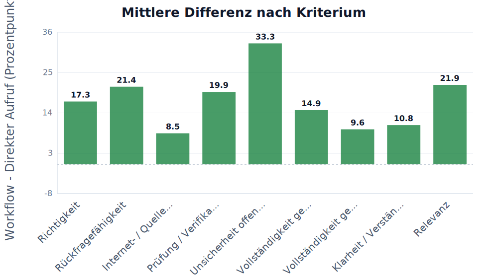
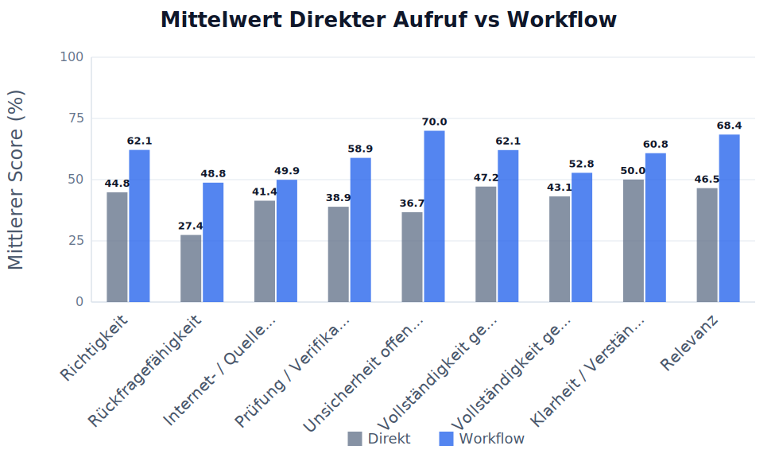
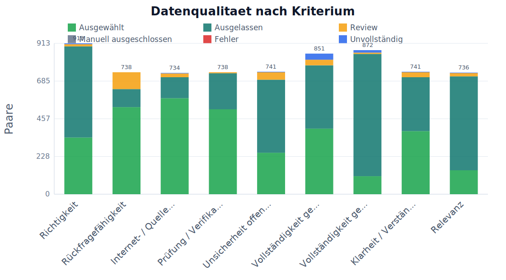
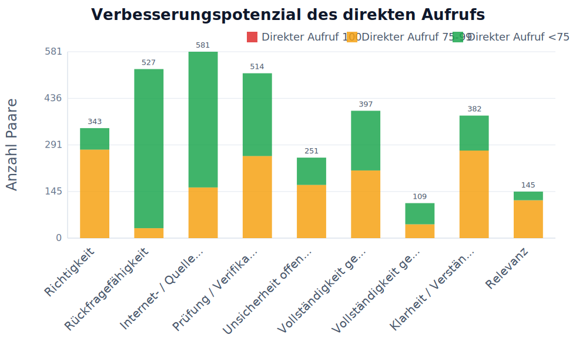

# Übersicht nach Kriterium

## Auswahl

- Kriterien: Alle Kriterien
- Fragensets: Basis-Fragenset, Beispiel-Fragenset, Flowmap | Fragenset 7, Flowreview | Fragenset 7, Grenzfaelle | fuer KI schwer loesbar, Prompt-Optimierung | absichtlich schwache Prompts, Prompt-Optimierung | schwierige Fragen, Fragenset 1 | Basis, Fragenset 2 | Prompt-Optimierung, Fragenset 3 | Flowmap, Fragenset 4 | Flowreview, Fragenset 5 | Prompt-Optimierung erweitert
- Run-Sets: Bestandsdaten | vor Strukturierung importiert, Direkt/Prompt | Fragenset 2 | 2026-05-16 | 10 Laeufe, Direkt/Prompt | schwierige Fragen | GPT-3.5 | 2026-05-16, Direkt/Prompt | schwache Prompts | GPT-3.5 | 2026-05-16, Flowmap | Fragenset 7 | 2026-05-16, Flowreview | Fragenset 7 | 2026-05-17, Flowreview | Fragenset 2 | 2026-05-17, Direkt/Prompt | Fragenset 2 | 2026-05-17 | Erweiterung, Direkt/Prompt | Fragenset 2 | 2026-05-17 | Lauf 5, Flowmap | Fragenset 3 | 2026-05-17, Flowreview | Fragenset 4 | 2026-05-17, Direkt/Prompt | Fragenset 3 | 2026-05-17 | Erweiterung, Direkt/Prompt | Fragenset 3 | 2026-05-17 | Lauf 3, Direkt/Prompt | Grenzfaelle | Set 2 | 2026-05-17, Direkt/Prompt | Grenzfaelle | Set 3 | 2026-05-17
- Workflow-Setups: C – Prompt-Optimierung, Flowmap, Flowreview
- Modelle: GPT-4o Mini, Claude Haiku 3.5, DeepSeek Chat, GPT-4o, GPT-4.1, GPT-3.5 Turbo (legacy)
- Max Paare pro Kriterium: kein Limit
- Skip Paare pro Kriterium: 0
- Direkt-Score behalten: behalte Direkt < 76%
- Stabiler Exportordner / Asset-Prefix: 75

Review-Antworten eingeschlossen: nein
Manuell ausgeschlossene Antworten eingeschlossen: nein

## Kurze Ergebnistabelle

| Kriterium | n | Mittel Direkter Aufruf | Mittel Workflow | Diff. | p-Wert | Ergebnis |
|---|---:|---:|---:|---:|---:|---|
| Richtigkeit | 343 | 69.1 | 76.9 | +7.8 | <0.0001 | signifikante Verbesserung |
| Rückfragefähigkeit | 527 | 30.2 | 49.9 | +19.7 | <0.0001 | signifikante Verbesserung |
| Internet- / Quellenqualität | 581 | 50.5 | 56.1 | +5.6 | <0.0001 | signifikante Verbesserung |
| Prüfung / Verifikation | 514 | 56.9 | 66.0 | +9.1 | <0.0001 | signifikante Verbesserung |
| Unsicherheit offenlegen | 251 | 62.0 | 77.4 | +15.4 | <0.0001 | signifikante Verbesserung |
| Vollständigkeit gemäß Möglichkeit | 397 | 62.0 | 71.1 | +9.1 | <0.0001 | signifikante Verbesserung |
| Vollständigkeit gemäß Frage | 109 | 55.7 | 60.6 | +4.9 | 0.0752 | nicht signifikant |
| Klarheit / Verständlichkeit | 382 | 67.9 | 72.5 | +4.6 | <0.0001 | signifikante Verbesserung |
| Relevanz | 145 | 69.7 | 80.8 | +11.1 | <0.0001 | signifikante Verbesserung |

LaTeX-gerenderte Tabelle:

Felderklärung:

- **Kriterium**: Bewerteter Qualitätsbereich, z.B. Richtigkeit oder Vollständigkeit.
- **n**: Anzahl der vollständigen ausgewählten Paare, die in Statistik und Mittelwerte eingehen.
- **Mittel Direkter Aufruf**: Durchschnittlicher Score der Antworten des direkten Aufrufs in Prozent.
- **Mittel Workflow**: Durchschnittlicher Score der Workflow-Antworten in Prozent.
- **Diff.**: Mittlere Differenz Workflow minus Direkter Aufruf in Prozentpunkten.
- **p-Wert**: Wahrscheinlichkeit für einen mindestens so starken Effekt, falls in Wahrheit kein Unterschied besteht.
- **Ergebnis**: Kurze Interpretation des Tests, z.B. signifikante Verbesserung oder nicht signifikant.

## Ausführliche Statistiktabelle

| Kriterium | n | Mittel Direkter Aufruf | Mittel Workflow | Diff. | SD Diff. | t-Wert | df | p-Wert | 95% KI | Cohen dz | Ergebnis |
|---|---:|---:|---:|---:|---:|---:|---:|---:|---|---:|---|
| Richtigkeit | 343 | 69.11 | 76.93 | +7.82 | 21.19 | 6.838 | 342 | <0.0001 | [+5.58; +10.07] | 0.37 | signifikante Verbesserung |
| Rückfragefähigkeit | 527 | 30.20 | 49.87 | +19.67 | 31.67 | 14.263 | 526 | <0.0001 | [+16.97; +22.38] | 0.62 | signifikante Verbesserung |
| Internet- / Quellenqualität | 581 | 50.54 | 56.12 | +5.58 | 23.17 | 5.803 | 580 | <0.0001 | [+3.69; +7.46] | 0.24 | signifikante Verbesserung |
| Prüfung / Verifikation | 514 | 56.90 | 66.03 | +9.14 | 27.89 | 7.428 | 513 | <0.0001 | [+6.73; +11.55] | 0.33 | signifikante Verbesserung |
| Unsicherheit offenlegen | 251 | 62.02 | 77.38 | +15.36 | 29.01 | 8.386 | 250 | <0.0001 | [+11.77; +18.95] | 0.53 | signifikante Verbesserung |
| Vollständigkeit gemäß Möglichkeit | 397 | 61.96 | 71.09 | +9.13 | 25.70 | 7.077 | 396 | <0.0001 | [+6.60; +11.66] | 0.36 | signifikante Verbesserung |
| Vollständigkeit gemäß Frage | 109 | 55.71 | 60.63 | +4.92 | 28.58 | 1.797 | 108 | 0.0752 | [-0.50; +10.34] | 0.17 | nicht signifikant |
| Klarheit / Verständlichkeit | 382 | 67.88 | 72.46 | +4.58 | 20.61 | 4.345 | 381 | <0.0001 | [+2.51; +6.65] | 0.22 | signifikante Verbesserung |
| Relevanz | 145 | 69.70 | 80.84 | +11.14 | 19.31 | 6.947 | 144 | <0.0001 | [+8.00; +14.29] | 0.58 | signifikante Verbesserung |

LaTeX-gerenderte Tabelle:

Felderklärung:

- **Kriterium**: Bewerteter Qualitätsbereich, z.B. Richtigkeit oder Vollständigkeit.
- **n**: Anzahl der vollständigen ausgewählten Paare, die in Statistik und Mittelwerte eingehen.
- **Mittel Direkter Aufruf**: Durchschnittlicher Score der Antworten des direkten Aufrufs in Prozent.
- **Mittel Workflow**: Durchschnittlicher Score der Workflow-Antworten in Prozent.
- **Diff.**: Mittlere Differenz Workflow minus Direkter Aufruf in Prozentpunkten.
- **p-Wert**: Wahrscheinlichkeit für einen mindestens so starken Effekt, falls in Wahrheit kein Unterschied besteht.
- **Ergebnis**: Kurze Interpretation des Tests, z.B. signifikante Verbesserung oder nicht signifikant.
- **SD Diff.**: Standardabweichung der paarweisen Differenzen; zeigt die Streuung des Effekts.
- **t-Wert**: Teststatistik des gepaarten t-Tests; wird mit dem kritischen Wert bzw. p-Wert beurteilt.
- **df**: Freiheitsgrade des Tests, hier normalerweise n minus 1.
- **95% KI**: 95-Prozent-Konfidenzintervall der mittleren Differenz; enthält es 0, ist der Effekt unsicherer.
- **Cohen dz**: Effektstärke für gepaarte Daten; macht die Größe des Effekts vergleichbarer.

## Tabelle zur Datengrundlage

| Kriterium | Gesamt | Gültig | Ausgewählt | Ausgelassen | Fehler | Review | Manuell ausgeschlossen | Unvollständig |
|---|---:|---:|---:|---:|---:|---:|---:|---:|
| Richtigkeit | 913 | 908 | 343 | 552 | 0 | 13 | 0 | 5 |
| Rückfragefähigkeit | 738 | 738 | 527 | 109 | 0 | 102 | 0 | 0 |
| Internet- / Quellenqualität | 734 | 731 | 581 | 127 | 0 | 23 | 0 | 3 |
| Prüfung / Verifikation | 738 | 738 | 514 | 218 | 0 | 6 | 0 | 0 |
| Unsicherheit offenlegen | 741 | 738 | 251 | 442 | 0 | 45 | 0 | 3 |
| Vollständigkeit gemäß Möglichkeit | 851 | 814 | 397 | 383 | 0 | 34 | 0 | 37 |
| Vollständigkeit gemäß Frage | 872 | 857 | 109 | 740 | 0 | 8 | 0 | 15 |
| Klarheit / Verständlichkeit | 741 | 738 | 382 | 326 | 0 | 30 | 0 | 3 |
| Relevanz | 736 | 733 | 145 | 568 | 0 | 20 | 0 | 3 |

LaTeX-gerenderte Tabelle:

Felderklärung:

- **Kriterium**: Bewerteter Qualitätsbereich.
- **Gesamt**: Alle gefundenen Paare nach den gesetzten Filtern vor Bereinigung.
- **Gueltig**: Paare nach Abzug von Unvollstaendig und Fehler. Review und manuell ausgeschlossen bleiben gueltig, werden aber je nach Filter nicht ausgewaehlt.
- **Ausgewählt**: Paare, die tatsächlich in Analyse, Statistik und Charts verwendet werden.
- **Ausgelassen**: Paare, die durch den optionalen Direkt-Score-Behalten-Bereich ausgeschlossen wurden, weil der direkte Aufruf außerhalb des eingestellten Bereichs lag.
- **Fehler**: Vollständig paarbare Paare, bei denen mindestens eine Seite einen technischen Fehler hatte. Unvollständige oder unpaarbare Fälle werden vorher als Unvollständig gezählt.
- **Review**: Gueltige Paare mit Review-Markierung; standardmaessig nicht in der Analyse enthalten, wenn Review nicht eingeschlossen ist.
- **Manuell ausgeschlossen**: Gueltige Paare, die vom Nutzer manuell aus der Analyse ausgeschlossen wurden. Wird erst nach Unvollstaendig und Fehler gezaehlt.
- **Unvollstaendig**: Paare oder unpaarbare Workflow-Laeufe mit fehlender Seite, laufendem Status, fehlendem Score oder fehlender gueltiger Paar-ID. Diese Kategorie hat Vorrang vor Fehler und manuell ausgeschlossen.

## Diagramme

### Mittlere Differenz nach Kriterium

| Feld | Wert |
|---|---|
| Datei | `75/images/00_overview/chart_mean_difference_by_criterion.svg` |
| Bedeutung | Einheit: Prozentpunkte. Bedeutung: Workflow minus Direkter Aufruf. Positive Werte bedeuten Verbesserung durch den Workflow, negative Werte Verschlechterung. |

Felderklärung:

- **X-Achse / Kriterium**: Verglichenes Bewertungskriterium.
- **Y-Achse / mittlere Differenz**: Workflow minus Direkter Aufruf in Prozentpunkten.
- **Y-Skala**: Skala der mittleren Differenzwerte mit Hilfslinien.
- **Zahlen auf Balken**: Konkrete mittlere Differenz pro Kriterium.
- **0-Linie**: Kein Unterschied zwischen Workflow und Direkter Aufruf.
- **Positive Werte**: Workflow wurde im Mittel höher bewertet.
- **Negative Werte**: Direkter Aufruf wurde im Mittel höher bewertet.

### Mittelwert Direkter Aufruf vs Workflow

| Feld | Wert |
|---|---|
| Datei | `75/images/00_overview/chart_mean_direkter_aufruf_vs_workflow.svg` |
| Bedeutung | Zeigt die durchschnittlichen Scores pro Kriterium und macht mögliche Deckeneffekte sichtbar. |

Felderklärung:

- **Kriterium**: Bewerteter Qualitätsbereich.
- **Direkter Aufruf**: Mittlerer Score der Antworten des direkten Aufrufs.
- **Workflow**: Mittlerer Score der Workflow-Antworten.
- **Y-Achse**: Durchschnittlicher Score in Prozent.
- **Y-Skala**: Skala von 0 bis 100 Prozent mit Hilfslinien.
- **Zahlen auf Balken**: Konkreter Mittelwert pro Methode.
- **Zweck**: Schneller Vergleich der beiden Methoden pro Kriterium.

### Datenqualitaet nach Kriterium

| Feld | Wert |
|---|---|
| Datei | `75/images/00_overview/chart_data_quality_by_criterion.svg` |
| Bedeutung | Zeigt die exklusiven Zaehlkategorien pro Kriterium: ausgewaehlt, ausgelassen, Review, manuell ausgeschlossen, Fehler und unvollstaendig. Gezaehlt wird ohne Doppelzaehlung nach Prioritaet: unvollstaendig vor Fehler vor manuell ausgeschlossen vor Review. |

Felderklärung:

- **Kriterium**: Bewerteter Qualitätsbereich.
- **Ausgewählt**: Paare, die in die Analyse eingehen.
- **Review**: Paare, die manuell geprüft werden sollten.
- **Y-Achse**: Anzahl der Paare.
- **Y-Skala**: Skala der Paaranzahl mit Hilfslinien.
- **Zahlen auf Balken**: Konkrete Anzahl der Paare.
- **Zweck**: Zeigt, ob die Datengrundlage pro Kriterium stabil genug ist.

### Verbesserungspotenzial des direkten Aufrufs

| Feld | Wert |
|---|---|
| Datei | `75/images/00_overview/chart_ceiling_effect_by_criterion.svg` |
| Bedeutung | Zeigt pro Kriterium, wie viele Antworten des direkten Aufrufs bereits 100%, nahe 100% oder deutlich darunter lagen. Viele 100%-Werte bedeuten Deckeneffekt: Der Workflow kann kaum noch verbessern, aber verschlechtern. |

Felderklärung:

- **Direkter Aufruf 100 / rot**: Direkter Aufruf war bereits perfekt; kaum messbares Verbesserungspotenzial.
- **Direkter Aufruf 75-99 / orange**: Direkter Aufruf war nahe an perfekt; wenig Verbesserungspotenzial.
- **Direkter Aufruf <75 / grün**: Direkter Aufruf hatte klarere Fehler; Workflow konnte eher verbessern.
- **Y-Achse**: Anzahl der Paare.
- **Y-Skala**: Skala der Paaranzahl mit Hilfslinien.
- **Zweck**: Macht den Deckeneffekt pro Kriterium sichtbar.
