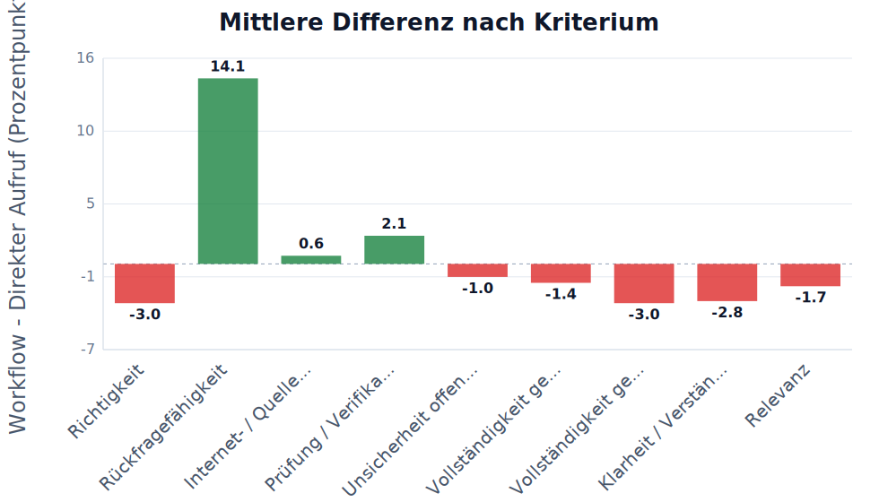
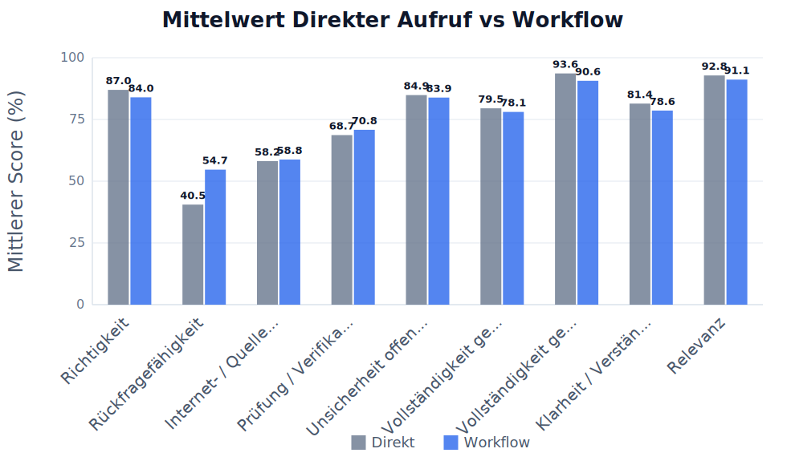
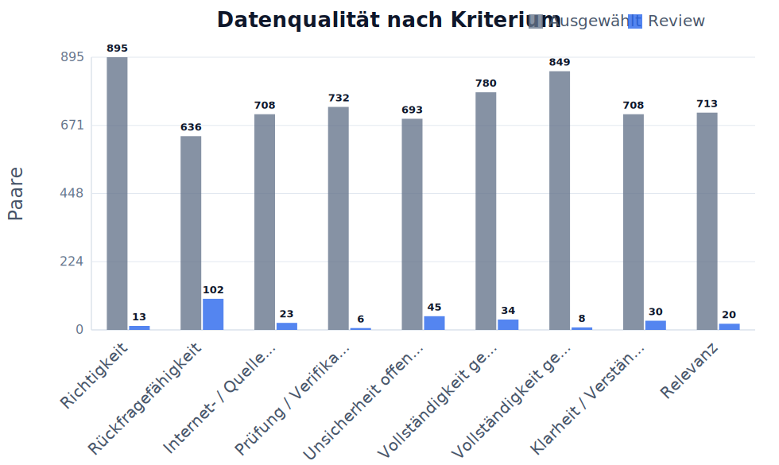
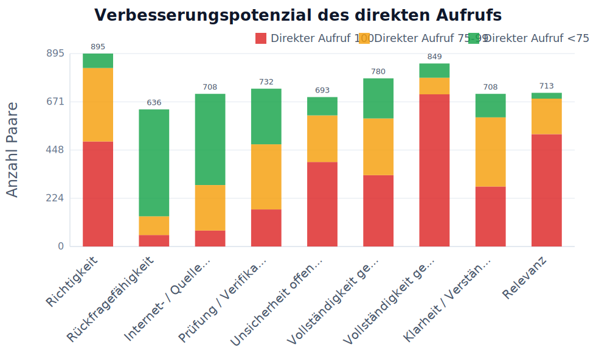

# Übersicht nach Kriterium

## Auswahl

- Kriterien: Alle Kriterien
- Fragensets: default, example, flowmap_set7, flowreview_set7, impossibleforai, lausyprompt, promptoptimierung_schwierig, set1, set2, set3, set4, set5
- Run-Sets: Existing runs, run10, gpt3_prompt_schwer, lazy_gpt3, flowmap7, review7, set2_review, set2_more, set2_5, set3_flowmap, set4_flowreview, set3_more, set3_3, imposs_2_single, imposs_3_single
- Workflow-Setups: C – Prompt-Optimierung, Flowmap, Flowreview
- Modelle: GPT-4o Mini, Claude Haiku 3.5, DeepSeek Chat, GPT-4o, GPT-4.1, GPT-3.5 Turbo (legacy)
- Max Paare pro Kriterium: kein Limit
- Skip Paare pro Kriterium: 0
- Direkt-Score behalten: aus, nichts ausgeschlossen
- Stabiler Exportordner / Asset-Prefix: ALL

Review-Antworten eingeschlossen: nein
Manuell ausgeschlossene Antworten eingeschlossen: nein

## Kurze Ergebnistabelle

| Kriterium | n | Mittel Direkter Aufruf | Mittel Workflow | Diff. | p-Wert | Ergebnis |
|---|---:|---:|---:|---:|---:|---|
| Richtigkeit | 895 | 87.0 | 84.0 | -3.0 | <0.0001 | signifikante Verschlechterung |
| Rückfragefähigkeit | 636 | 40.5 | 54.7 | +14.1 | <0.0001 | signifikante Verbesserung |
| Internet- / Quellenqualität | 708 | 58.2 | 58.8 | +0.6 | 0.5381 | nicht signifikant |
| Prüfung / Verifikation | 732 | 68.7 | 70.8 | +2.1 | 0.0519 | nicht signifikant |
| Unsicherheit offenlegen | 693 | 84.9 | 83.9 | -1.0 | 0.3460 | nicht signifikant |
| Vollständigkeit gemäß Möglichkeit | 780 | 79.5 | 78.1 | -1.4 | 0.1409 | nicht signifikant |
| Vollständigkeit gemäß Frage | 849 | 93.6 | 90.6 | -3.0 | <0.0001 | signifikante Verschlechterung |
| Klarheit / Verständlichkeit | 708 | 81.4 | 78.6 | -2.8 | 0.0005 | signifikante Verschlechterung |
| Relevanz | 713 | 92.8 | 91.1 | -1.7 | 0.0060 | signifikante Verschlechterung |

LaTeX-gerenderte Tabelle:

Felderklärung:

- **Kriterium**: Bewerteter Qualitätsbereich, z.B. Richtigkeit oder Vollständigkeit.
- **n**: Anzahl der vollständigen ausgewählten Paare, die in Statistik und Mittelwerte eingehen.
- **Mittel Direkter Aufruf**: Durchschnittlicher Score der Antworten des direkten Aufrufs in Prozent.
- **Mittel Workflow**: Durchschnittlicher Score der Workflow-Antworten in Prozent.
- **Diff.**: Mittlere Differenz Workflow minus Direkter Aufruf in Prozentpunkten.
- **p-Wert**: Wahrscheinlichkeit für einen mindestens so starken Effekt, falls in Wahrheit kein Unterschied besteht.
- **Ergebnis**: Kurze Interpretation des Tests, z.B. signifikante Verbesserung oder nicht signifikant.

## Ausführliche Statistiktabelle

| Kriterium | n | Mittel Direkter Aufruf | Mittel Workflow | Diff. | SD Diff. | t-Wert | df | p-Wert | 95% KI | Cohen dz | Ergebnis |
|---|---:|---:|---:|---:|---:|---:|---:|---:|---|---:|---|
| Richtigkeit | 895 | 86.97 | 83.98 | -2.99 | 21.38 | -4.185 | 894 | <0.0001 | [-4.39; -1.59] | -0.14 | signifikante Verschlechterung |
| Rückfragefähigkeit | 636 | 40.52 | 54.66 | +14.14 | 32.74 | 10.892 | 635 | <0.0001 | [+11.60; +16.69] | 0.43 | signifikante Verbesserung |
| Internet- / Quellenqualität | 708 | 58.16 | 58.78 | +0.62 | 26.81 | 0.616 | 707 | 0.5381 | [-1.35; +2.60] | 0.02 | nicht signifikant |
| Prüfung / Verifikation | 732 | 68.68 | 70.83 | +2.14 | 29.77 | 1.947 | 731 | 0.0519 | [-0.01; +4.30] | 0.07 | nicht signifikant |
| Unsicherheit offenlegen | 693 | 84.86 | 83.87 | -0.99 | 27.66 | -0.943 | 692 | 0.3460 | [-3.05; +1.07] | -0.04 | nicht signifikant |
| Vollständigkeit gemäß Möglichkeit | 780 | 79.51 | 78.07 | -1.44 | 27.32 | -1.474 | 779 | 0.1409 | [-3.36; +0.48] | -0.05 | nicht signifikant |
| Vollständigkeit gemäß Frage | 849 | 93.63 | 90.64 | -2.99 | 18.31 | -4.759 | 848 | <0.0001 | [-4.22; -1.76] | -0.16 | signifikante Verschlechterung |
| Klarheit / Verständlichkeit | 708 | 81.43 | 78.60 | -2.83 | 21.62 | -3.487 | 707 | 0.0005 | [-4.43; -1.24] | -0.13 | signifikante Verschlechterung |
| Relevanz | 713 | 92.83 | 91.13 | -1.70 | 16.47 | -2.754 | 712 | 0.0060 | [-2.91; -0.49] | -0.10 | signifikante Verschlechterung |

LaTeX-gerenderte Tabelle:

Felderklärung:

- **Kriterium**: Bewerteter Qualitätsbereich, z.B. Richtigkeit oder Vollständigkeit.
- **n**: Anzahl der vollständigen ausgewählten Paare, die in Statistik und Mittelwerte eingehen.
- **Mittel Direkter Aufruf**: Durchschnittlicher Score der Antworten des direkten Aufrufs in Prozent.
- **Mittel Workflow**: Durchschnittlicher Score der Workflow-Antworten in Prozent.
- **Diff.**: Mittlere Differenz Workflow minus Direkter Aufruf in Prozentpunkten.
- **p-Wert**: Wahrscheinlichkeit für einen mindestens so starken Effekt, falls in Wahrheit kein Unterschied besteht.
- **Ergebnis**: Kurze Interpretation des Tests, z.B. signifikante Verbesserung oder nicht signifikant.
- **SD Diff.**: Standardabweichung der paarweisen Differenzen; zeigt die Streuung des Effekts.
- **t-Wert**: Teststatistik des gepaarten t-Tests; wird mit dem kritischen Wert bzw. p-Wert beurteilt.
- **df**: Freiheitsgrade des Tests, hier normalerweise n minus 1.
- **95% KI**: 95-Prozent-Konfidenzintervall der mittleren Differenz; enthält es 0, ist der Effekt unsicherer.
- **Cohen dz**: Effektstärke für gepaarte Daten; macht die Größe des Effekts vergleichbarer.

## Tabelle zur Datengrundlage

| Kriterium | Gesamt | Gültig | Ausgewählt | Ausgelassen | Fehler | Review | Manuell ausgeschlossen | Unvollständig |
|---|---:|---:|---:|---:|---:|---:|---:|---:|
| Richtigkeit | 908 | 908 | 895 | 0 | 0 | 13 | 0 | 0 |
| Rückfragefähigkeit | 738 | 738 | 636 | 0 | 0 | 102 | 0 | 0 |
| Internet- / Quellenqualität | 732 | 731 | 708 | 0 | 0 | 23 | 0 | 1 |
| Prüfung / Verifikation | 738 | 738 | 732 | 0 | 0 | 6 | 0 | 0 |
| Unsicherheit offenlegen | 738 | 738 | 693 | 0 | 0 | 45 | 0 | 0 |
| Vollständigkeit gemäß Möglichkeit | 817 | 814 | 780 | 0 | 3 | 34 | 0 | 0 |
| Vollständigkeit gemäß Frage | 866 | 857 | 849 | 0 | 8 | 8 | 0 | 1 |
| Klarheit / Verständlichkeit | 738 | 738 | 708 | 0 | 0 | 30 | 0 | 0 |
| Relevanz | 733 | 733 | 713 | 0 | 0 | 20 | 0 | 0 |

LaTeX-gerenderte Tabelle:

Felderklärung:

- **Kriterium**: Bewerteter Qualitätsbereich.
- **Gesamt**: Alle gefundenen Paare nach den gesetzten Filtern vor Bereinigung.
- **Gültig**: Paare ohne Fehler und ohne unvollständige oder unbewertete Seite.
- **Ausgewählt**: Paare, die tatsächlich in Analyse, Statistik und Charts verwendet werden.
- **Ausgelassen**: Paare, die durch den optionalen Direkt-Score-Behalten-Bereich ausgeschlossen wurden, weil der direkte Aufruf außerhalb des eingestellten Bereichs lag.
- **Fehler**: Paare, bei denen mindestens eine Seite einen technischen Fehler hatte.
- **Review**: Paare mit Review-Markierung; standardmäßig nicht in der Analyse enthalten.
- **Manuell ausgeschlossen**: Paare, die vom Nutzer manuell aus der Analyse ausgeschlossen wurden.
- **Unvollständig**: Paare mit fehlender Seite, laufendem Run oder fehlendem Score.

## Diagramme

### Mittlere Differenz nach Kriterium

| Feld | Wert |
|---|---|
| Datei | `ALL/images/00_overview/chart_mean_difference_by_criterion.svg` |
| Bedeutung | Einheit: Prozentpunkte. Bedeutung: Workflow minus Direkter Aufruf. Positive Werte bedeuten Verbesserung durch den Workflow, negative Werte Verschlechterung. |

Felderklärung:

- **X-Achse / Kriterium**: Verglichenes Bewertungskriterium.
- **Y-Achse / mittlere Differenz**: Workflow minus Direkter Aufruf in Prozentpunkten.
- **Y-Skala**: Skala der mittleren Differenzwerte mit Hilfslinien.
- **Zahlen auf Balken**: Konkrete mittlere Differenz pro Kriterium.
- **0-Linie**: Kein Unterschied zwischen Workflow und Direkter Aufruf.
- **Positive Werte**: Workflow wurde im Mittel höher bewertet.
- **Negative Werte**: Direkter Aufruf wurde im Mittel höher bewertet.

### Mittelwert Direkter Aufruf vs Workflow

| Feld | Wert |
|---|---|
| Datei | `ALL/images/00_overview/chart_mean_direkter_aufruf_vs_workflow.svg` |
| Bedeutung | Zeigt die durchschnittlichen Scores pro Kriterium und macht mögliche Deckeneffekte sichtbar. |

Felderklärung:

- **Kriterium**: Bewerteter Qualitätsbereich.
- **Direkter Aufruf**: Mittlerer Score der Antworten des direkten Aufrufs.
- **Workflow**: Mittlerer Score der Workflow-Antworten.
- **Y-Achse**: Durchschnittlicher Score in Prozent.
- **Y-Skala**: Skala von 0 bis 100 Prozent mit Hilfslinien.
- **Zahlen auf Balken**: Konkreter Mittelwert pro Methode.
- **Zweck**: Schneller Vergleich der beiden Methoden pro Kriterium.

### Datenqualität nach Kriterium

| Feld | Wert |
|---|---|
| Datei | `ALL/images/00_overview/chart_data_quality_by_criterion.svg` |
| Bedeutung | Zeigt ausgewählte Paare und Review-Paare pro Kriterium zur Transparenz der Datengrundlage. |

Felderklärung:

- **Kriterium**: Bewerteter Qualitätsbereich.
- **Ausgewählt**: Paare, die in die Analyse eingehen.
- **Review**: Paare, die manuell geprüft werden sollten.
- **Y-Achse**: Anzahl der Paare.
- **Y-Skala**: Skala der Paaranzahl mit Hilfslinien.
- **Zahlen auf Balken**: Konkrete Anzahl der Paare.
- **Zweck**: Zeigt, ob die Datengrundlage pro Kriterium stabil genug ist.

### Verbesserungspotenzial des direkten Aufrufs

| Feld | Wert |
|---|---|
| Datei | `ALL/images/00_overview/chart_ceiling_effect_by_criterion.svg` |
| Bedeutung | Zeigt pro Kriterium, wie viele Antworten des direkten Aufrufs bereits 100%, nahe 100% oder deutlich darunter lagen. Viele 100%-Werte bedeuten Deckeneffekt: Der Workflow kann kaum noch verbessern, aber verschlechtern. |

Felderklärung:

- **Direkter Aufruf 100 / rot**: Direkter Aufruf war bereits perfekt; kaum messbares Verbesserungspotenzial.
- **Direkter Aufruf 75-99 / orange**: Direkter Aufruf war nahe an perfekt; wenig Verbesserungspotenzial.
- **Direkter Aufruf <75 / grün**: Direkter Aufruf hatte klarere Fehler; Workflow konnte eher verbessern.
- **Y-Achse**: Anzahl der Paare.
- **Y-Skala**: Skala der Paaranzahl mit Hilfslinien.
- **Zweck**: Macht den Deckeneffekt pro Kriterium sichtbar.
