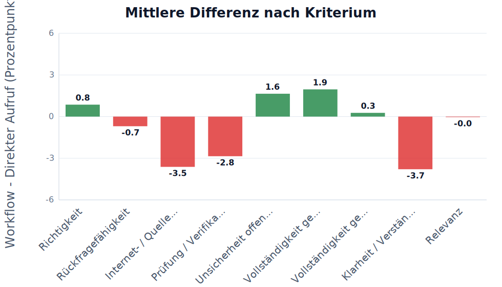
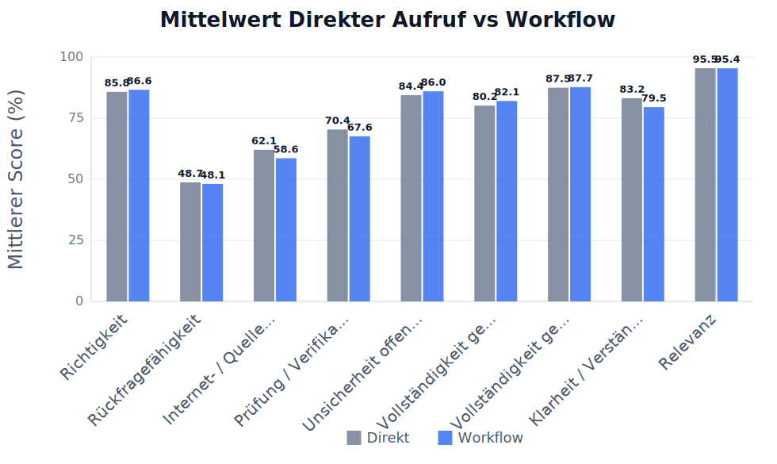
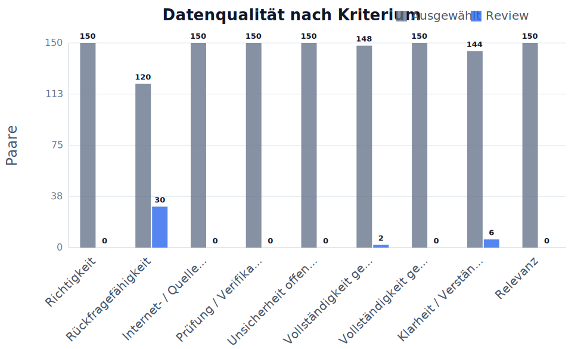
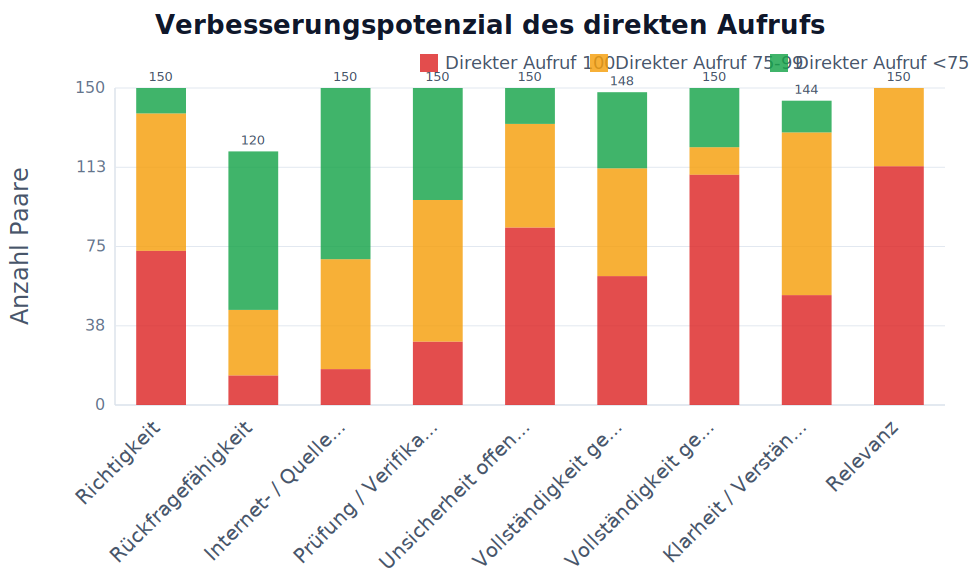

# Übersicht nach Kriterium

## Auswahl

- Kriterien: Alle Kriterien
- Fragensets: default, example, flowmap_set7, flowreview_set7, impossibleforai, lausyprompt, promptoptimierung_schwierig, set1, set2, set3, set4, set5
- Run-Sets: Existing runs, run10, gpt3_prompt_schwer, lazy_gpt3, flowmap7, review7, set2_review, set2_more, set2_5, set3_flowmap, set4_flowreview, set3_more, set3_3, imposs_2_single, imposs_3_single
- Workflow-Setups: Flowreview
- Modelle: GPT-4o Mini, Claude Haiku 3.5, DeepSeek Chat, GPT-4o, GPT-4.1, GPT-3.5 Turbo (legacy)
- Max Paare pro Kriterium: kein Limit
- Skip Paare pro Kriterium: 0
- Direkt-Score behalten: aus, nichts ausgeschlossen
- Stabiler Exportordner / Asset-Prefix: FR

Review-Antworten eingeschlossen: nein
Manuell ausgeschlossene Antworten eingeschlossen: nein

## Kurze Ergebnistabelle

| Kriterium | n | Mittel Direkter Aufruf | Mittel Workflow | Diff. | p-Wert | Ergebnis |
|---|---:|---:|---:|---:|---:|---|
| Richtigkeit | 150 | 85.8 | 86.6 | +0.8 | 0.5161 | nicht signifikant |
| Rückfragefähigkeit | 120 | 48.7 | 48.1 | -0.7 | 0.7487 | nicht signifikant |
| Internet- / Quellenqualität | 150 | 62.1 | 58.6 | -3.5 | 0.0837 | nicht signifikant |
| Prüfung / Verifikation | 150 | 70.4 | 67.6 | -2.8 | 0.1900 | nicht signifikant |
| Unsicherheit offenlegen | 150 | 84.4 | 86.0 | +1.6 | 0.4833 | nicht signifikant |
| Vollständigkeit gemäß Möglichkeit | 148 | 80.2 | 82.1 | +1.9 | 0.2579 | nicht signifikant |
| Vollständigkeit gemäß Frage | 150 | 87.5 | 87.7 | +0.3 | 0.8583 | nicht signifikant |
| Klarheit / Verständlichkeit | 144 | 83.2 | 79.5 | -3.7 | 0.0188 | signifikante Verschlechterung |
| Relevanz | 150 | 95.5 | 95.4 | -0.0 | 0.9654 | nicht signifikant |

LaTeX-gerenderte Tabelle:

Felderklärung:

- **Kriterium**: Bewerteter Qualitätsbereich, z.B. Richtigkeit oder Vollständigkeit.
- **n**: Anzahl der vollständigen ausgewählten Paare, die in Statistik und Mittelwerte eingehen.
- **Mittel Direkter Aufruf**: Durchschnittlicher Score der Antworten des direkten Aufrufs in Prozent.
- **Mittel Workflow**: Durchschnittlicher Score der Workflow-Antworten in Prozent.
- **Diff.**: Mittlere Differenz Workflow minus Direkter Aufruf in Prozentpunkten.
- **p-Wert**: Wahrscheinlichkeit für einen mindestens so starken Effekt, falls in Wahrheit kein Unterschied besteht.
- **Ergebnis**: Kurze Interpretation des Tests, z.B. signifikante Verbesserung oder nicht signifikant.

## Ausführliche Statistiktabelle

| Kriterium | n | Mittel Direkter Aufruf | Mittel Workflow | Diff. | SD Diff. | t-Wert | df | p-Wert | 95% KI | Cohen dz | Ergebnis |
|---|---:|---:|---:|---:|---:|---:|---:|---:|---|---:|---|
| Richtigkeit | 150 | 85.78 | 86.61 | +0.83 | 15.68 | 0.651 | 149 | 0.5161 | [-1.68; +3.34] | 0.05 | nicht signifikant |
| Rückfragefähigkeit | 120 | 48.75 | 48.08 | -0.67 | 22.90 | -0.321 | 119 | 0.7487 | [-4.81; +3.47] | -0.03 | nicht signifikant |
| Internet- / Quellenqualität | 150 | 62.09 | 58.59 | -3.50 | 24.62 | -1.741 | 149 | 0.0837 | [-7.44; +0.44] | -0.14 | nicht signifikant |
| Prüfung / Verifikation | 150 | 70.35 | 67.59 | -2.76 | 25.67 | -1.316 | 149 | 0.1900 | [-6.87; +1.35] | -0.11 | nicht signifikant |
| Unsicherheit offenlegen | 150 | 84.43 | 86.02 | +1.59 | 27.75 | 0.703 | 149 | 0.4833 | [-2.85; +6.03] | 0.06 | nicht signifikant |
| Vollständigkeit gemäß Möglichkeit | 148 | 80.16 | 82.06 | +1.90 | 20.31 | 1.136 | 147 | 0.2579 | [-1.38; +5.17] | 0.09 | nicht signifikant |
| Vollständigkeit gemäß Frage | 150 | 87.48 | 87.74 | +0.26 | 17.75 | 0.179 | 149 | 0.8583 | [-2.58; +3.10] | 0.01 | nicht signifikant |
| Klarheit / Verständlichkeit | 144 | 83.18 | 79.51 | -3.67 | 18.51 | -2.377 | 143 | 0.0188 | [-6.69; -0.64] | -0.20 | signifikante Verschlechterung |
| Relevanz | 150 | 95.46 | 95.43 | -0.04 | 10.43 | -0.043 | 149 | 0.9654 | [-1.71; +1.63] | -0.00 | nicht signifikant |

LaTeX-gerenderte Tabelle:

Felderklärung:

- **Kriterium**: Bewerteter Qualitätsbereich, z.B. Richtigkeit oder Vollständigkeit.
- **n**: Anzahl der vollständigen ausgewählten Paare, die in Statistik und Mittelwerte eingehen.
- **Mittel Direkter Aufruf**: Durchschnittlicher Score der Antworten des direkten Aufrufs in Prozent.
- **Mittel Workflow**: Durchschnittlicher Score der Workflow-Antworten in Prozent.
- **Diff.**: Mittlere Differenz Workflow minus Direkter Aufruf in Prozentpunkten.
- **p-Wert**: Wahrscheinlichkeit für einen mindestens so starken Effekt, falls in Wahrheit kein Unterschied besteht.
- **Ergebnis**: Kurze Interpretation des Tests, z.B. signifikante Verbesserung oder nicht signifikant.
- **SD Diff.**: Standardabweichung der paarweisen Differenzen; zeigt die Streuung des Effekts.
- **t-Wert**: Teststatistik des gepaarten t-Tests; wird mit dem kritischen Wert bzw. p-Wert beurteilt.
- **df**: Freiheitsgrade des Tests, hier normalerweise n minus 1.
- **95% KI**: 95-Prozent-Konfidenzintervall der mittleren Differenz; enthält es 0, ist der Effekt unsicherer.
- **Cohen dz**: Effektstärke für gepaarte Daten; macht die Größe des Effekts vergleichbarer.

## Tabelle zur Datengrundlage

| Kriterium | Gesamt | Gültig | Ausgewählt | Ausgelassen | Fehler | Review | Manuell ausgeschlossen | Unvollständig |
|---|---:|---:|---:|---:|---:|---:|---:|---:|
| Richtigkeit | 150 | 150 | 150 | 0 | 0 | 0 | 0 | 0 |
| Rückfragefähigkeit | 150 | 150 | 120 | 0 | 0 | 30 | 0 | 0 |
| Internet- / Quellenqualität | 150 | 150 | 150 | 0 | 0 | 0 | 0 | 0 |
| Prüfung / Verifikation | 150 | 150 | 150 | 0 | 0 | 0 | 0 | 0 |
| Unsicherheit offenlegen | 150 | 150 | 150 | 0 | 0 | 0 | 0 | 0 |
| Vollständigkeit gemäß Möglichkeit | 150 | 150 | 148 | 0 | 0 | 2 | 0 | 0 |
| Vollständigkeit gemäß Frage | 150 | 150 | 150 | 0 | 0 | 0 | 0 | 0 |
| Klarheit / Verständlichkeit | 150 | 150 | 144 | 0 | 0 | 6 | 0 | 0 |
| Relevanz | 150 | 150 | 150 | 0 | 0 | 0 | 0 | 0 |

LaTeX-gerenderte Tabelle:

Felderklärung:

- **Kriterium**: Bewerteter Qualitätsbereich.
- **Gesamt**: Alle gefundenen Paare nach den gesetzten Filtern vor Bereinigung.
- **Gültig**: Paare ohne Fehler und ohne unvollständige oder unbewertete Seite.
- **Ausgewählt**: Paare, die tatsächlich in Analyse, Statistik und Charts verwendet werden.
- **Ausgelassen**: Paare, die durch den optionalen Direkt-Score-Behalten-Bereich ausgeschlossen wurden, weil der direkte Aufruf außerhalb des eingestellten Bereichs lag.
- **Fehler**: Paare, bei denen mindestens eine Seite einen technischen Fehler hatte.
- **Review**: Paare mit Review-Markierung; standardmäßig nicht in der Analyse enthalten.
- **Manuell ausgeschlossen**: Paare, die vom Nutzer manuell aus der Analyse ausgeschlossen wurden.
- **Unvollständig**: Paare mit fehlender Seite, laufendem Run oder fehlendem Score.

## Diagramme

### Mittlere Differenz nach Kriterium

| Feld | Wert |
|---|---|
| Datei | `FR/images/00_overview/chart_mean_difference_by_criterion.svg` |
| Bedeutung | Einheit: Prozentpunkte. Bedeutung: Workflow minus Direkter Aufruf. Positive Werte bedeuten Verbesserung durch den Workflow, negative Werte Verschlechterung. |

Felderklärung:

- **X-Achse / Kriterium**: Verglichenes Bewertungskriterium.
- **Y-Achse / mittlere Differenz**: Workflow minus Direkter Aufruf in Prozentpunkten.
- **Y-Skala**: Skala der mittleren Differenzwerte mit Hilfslinien.
- **Zahlen auf Balken**: Konkrete mittlere Differenz pro Kriterium.
- **0-Linie**: Kein Unterschied zwischen Workflow und Direkter Aufruf.
- **Positive Werte**: Workflow wurde im Mittel höher bewertet.
- **Negative Werte**: Direkter Aufruf wurde im Mittel höher bewertet.

### Mittelwert Direkter Aufruf vs Workflow

| Feld | Wert |
|---|---|
| Datei | `FR/images/00_overview/chart_mean_direkter_aufruf_vs_workflow.svg` |
| Bedeutung | Zeigt die durchschnittlichen Scores pro Kriterium und macht mögliche Deckeneffekte sichtbar. |

Felderklärung:

- **Kriterium**: Bewerteter Qualitätsbereich.
- **Direkter Aufruf**: Mittlerer Score der Antworten des direkten Aufrufs.
- **Workflow**: Mittlerer Score der Workflow-Antworten.
- **Y-Achse**: Durchschnittlicher Score in Prozent.
- **Y-Skala**: Skala von 0 bis 100 Prozent mit Hilfslinien.
- **Zahlen auf Balken**: Konkreter Mittelwert pro Methode.
- **Zweck**: Schneller Vergleich der beiden Methoden pro Kriterium.

### Datenqualität nach Kriterium

| Feld | Wert |
|---|---|
| Datei | `FR/images/00_overview/chart_data_quality_by_criterion.svg` |
| Bedeutung | Zeigt ausgewählte Paare und Review-Paare pro Kriterium zur Transparenz der Datengrundlage. |

Felderklärung:

- **Kriterium**: Bewerteter Qualitätsbereich.
- **Ausgewählt**: Paare, die in die Analyse eingehen.
- **Review**: Paare, die manuell geprüft werden sollten.
- **Y-Achse**: Anzahl der Paare.
- **Y-Skala**: Skala der Paaranzahl mit Hilfslinien.
- **Zahlen auf Balken**: Konkrete Anzahl der Paare.
- **Zweck**: Zeigt, ob die Datengrundlage pro Kriterium stabil genug ist.

### Verbesserungspotenzial des direkten Aufrufs

| Feld | Wert |
|---|---|
| Datei | `FR/images/00_overview/chart_ceiling_effect_by_criterion.svg` |
| Bedeutung | Zeigt pro Kriterium, wie viele Antworten des direkten Aufrufs bereits 100%, nahe 100% oder deutlich darunter lagen. Viele 100%-Werte bedeuten Deckeneffekt: Der Workflow kann kaum noch verbessern, aber verschlechtern. |

Felderklärung:

- **Direkter Aufruf 100 / rot**: Direkter Aufruf war bereits perfekt; kaum messbares Verbesserungspotenzial.
- **Direkter Aufruf 75-99 / orange**: Direkter Aufruf war nahe an perfekt; wenig Verbesserungspotenzial.
- **Direkter Aufruf <75 / grün**: Direkter Aufruf hatte klarere Fehler; Workflow konnte eher verbessern.
- **Y-Achse**: Anzahl der Paare.
- **Y-Skala**: Skala der Paaranzahl mit Hilfslinien.
- **Zweck**: Macht den Deckeneffekt pro Kriterium sichtbar.
