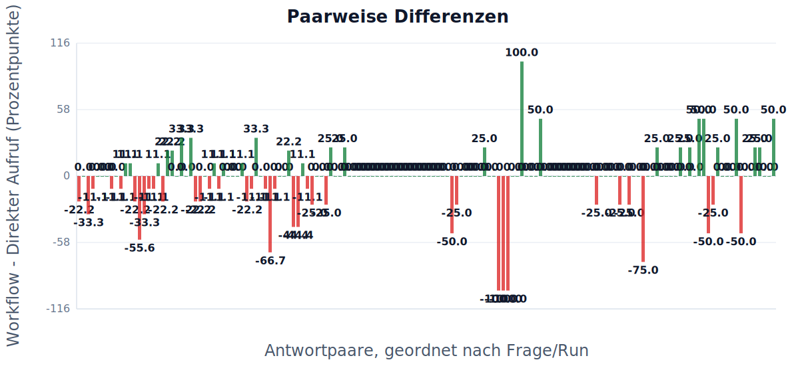
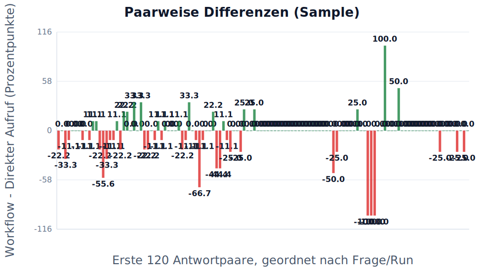
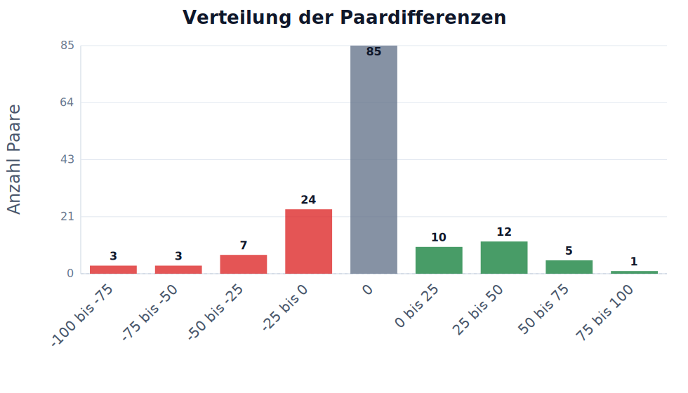
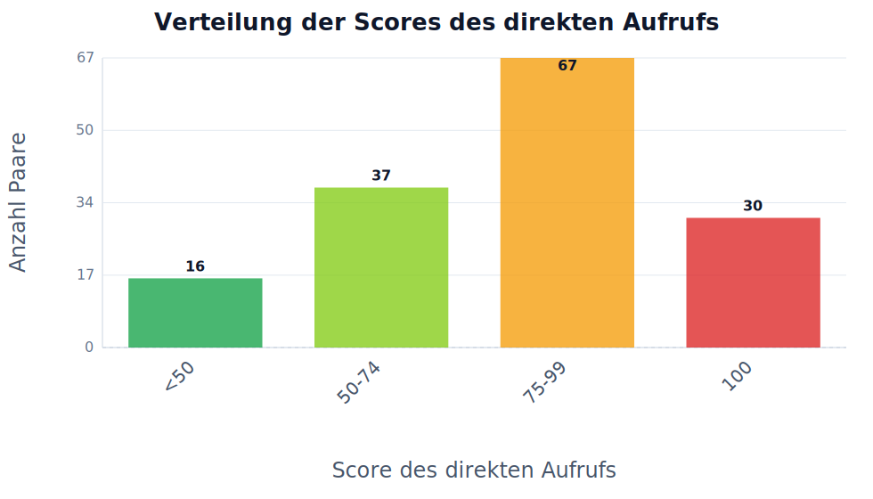
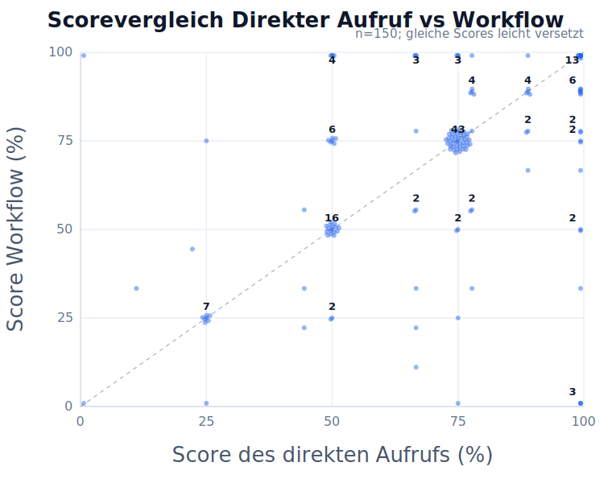

# Ausgewählte Analyse

## Auswahl

- Kriterien: Prüfung / Verifikation
- Fragensets: default, example, flowmap_set7, flowreview_set7, impossibleforai, lausyprompt, promptoptimierung_schwierig, set1, set2, set3, set4, set5
- Run-Sets: Existing runs, run10, gpt3_prompt_schwer, lazy_gpt3, flowmap7, review7, set2_review, set2_more, set2_5, set3_flowmap, set4_flowreview, set3_more, set3_3, imposs_2_single, imposs_3_single
- Workflow-Setups: Flowreview
- Modelle: GPT-4o Mini, Claude Haiku 3.5, DeepSeek Chat, GPT-4o, GPT-4.1, GPT-3.5 Turbo (legacy)
- Max Paare pro Kriterium: kein Limit
- Skip Paare pro Kriterium: 0
- Direkt-Score behalten: aus, nichts ausgeschlossen
- Stabiler Exportordner / Asset-Prefix: FR

Review-Antworten eingeschlossen: nein
Manuell ausgeschlossene Antworten eingeschlossen: nein

## Kurze Ergebnistabelle

| Kriterium | n | Mittel Direkter Aufruf | Mittel Workflow | Diff. | p-Wert | Ergebnis |
|---|---:|---:|---:|---:|---:|---|
| Prüfung / Verifikation | 150 | 70.4 | 67.6 | -2.8 | 0.1900 | nicht signifikant |

LaTeX-gerenderte Tabelle:

Felderklärung:

- **Kriterium**: Bewerteter Qualitätsbereich, z.B. Richtigkeit oder Vollständigkeit.
- **n**: Anzahl der vollständigen ausgewählten Paare, die in Statistik und Mittelwerte eingehen.
- **Mittel Direkter Aufruf**: Durchschnittlicher Score der Antworten des direkten Aufrufs in Prozent.
- **Mittel Workflow**: Durchschnittlicher Score der Workflow-Antworten in Prozent.
- **Diff.**: Mittlere Differenz Workflow minus Direkter Aufruf in Prozentpunkten.
- **p-Wert**: Wahrscheinlichkeit für einen mindestens so starken Effekt, falls in Wahrheit kein Unterschied besteht.
- **Ergebnis**: Kurze Interpretation des Tests, z.B. signifikante Verbesserung oder nicht signifikant.

## Ausführliche Statistiktabelle

| Kriterium | n | Mittel Direkter Aufruf | Mittel Workflow | Diff. | SD Diff. | t-Wert | df | p-Wert | 95% KI | Cohen dz | Ergebnis |
|---|---:|---:|---:|---:|---:|---:|---:|---:|---|---:|---|
| Prüfung / Verifikation | 150 | 70.35 | 67.59 | -2.76 | 25.67 | -1.316 | 149 | 0.1900 | [-6.87; +1.35] | -0.11 | nicht signifikant |

LaTeX-gerenderte Tabelle:

Felderklärung:

- **Kriterium**: Bewerteter Qualitätsbereich, z.B. Richtigkeit oder Vollständigkeit.
- **n**: Anzahl der vollständigen ausgewählten Paare, die in Statistik und Mittelwerte eingehen.
- **Mittel Direkter Aufruf**: Durchschnittlicher Score der Antworten des direkten Aufrufs in Prozent.
- **Mittel Workflow**: Durchschnittlicher Score der Workflow-Antworten in Prozent.
- **Diff.**: Mittlere Differenz Workflow minus Direkter Aufruf in Prozentpunkten.
- **p-Wert**: Wahrscheinlichkeit für einen mindestens so starken Effekt, falls in Wahrheit kein Unterschied besteht.
- **Ergebnis**: Kurze Interpretation des Tests, z.B. signifikante Verbesserung oder nicht signifikant.
- **SD Diff.**: Standardabweichung der paarweisen Differenzen; zeigt die Streuung des Effekts.
- **t-Wert**: Teststatistik des gepaarten t-Tests; wird mit dem kritischen Wert bzw. p-Wert beurteilt.
- **df**: Freiheitsgrade des Tests, hier normalerweise n minus 1.
- **95% KI**: 95-Prozent-Konfidenzintervall der mittleren Differenz; enthält es 0, ist der Effekt unsicherer.
- **Cohen dz**: Effektstärke für gepaarte Daten; macht die Größe des Effekts vergleichbarer.

## Tabelle zur Datengrundlage

| Kriterium | Gesamt | Gültig | Ausgewählt | Ausgelassen | Fehler | Review | Manuell ausgeschlossen | Unvollständig |
|---|---:|---:|---:|---:|---:|---:|---:|---:|
| Prüfung / Verifikation | 150 | 150 | 150 | 0 | 0 | 0 | 0 | 0 |

LaTeX-gerenderte Tabelle:

Felderklärung:

- **Kriterium**: Bewerteter Qualitätsbereich.
- **Gesamt**: Alle gefundenen Paare nach den gesetzten Filtern vor Bereinigung.
- **Gültig**: Paare ohne Fehler und ohne unvollständige oder unbewertete Seite.
- **Ausgewählt**: Paare, die tatsächlich in Analyse, Statistik und Charts verwendet werden.
- **Ausgelassen**: Paare, die durch den optionalen Direkt-Score-Behalten-Bereich ausgeschlossen wurden, weil der direkte Aufruf außerhalb des eingestellten Bereichs lag.
- **Fehler**: Paare, bei denen mindestens eine Seite einen technischen Fehler hatte.
- **Review**: Paare mit Review-Markierung; standardmäßig nicht in der Analyse enthalten.
- **Manuell ausgeschlossen**: Paare, die vom Nutzer manuell aus der Analyse ausgeschlossen wurden.
- **Unvollständig**: Paare mit fehlender Seite, laufendem Run oder fehlendem Score.

## Diagramme

### Paarweise Differenzen

| Feld | Wert |
|---|---|
| Datei | `FR/images/04_pruefung_verifikation/chart_paired_differences.svg` |
| Bedeutung | Zeigt für jedes Paar die Differenz Workflow minus Direkter Aufruf. |

Felderklärung:

- **X-Achse / Antwortpaar**: Ein gepaarter Vergleich aus direktem Aufruf und Workflow.
- **Y-Achse / Differenz**: Workflow minus Direkter Aufruf in Prozentpunkten.
- **Zahlen auf Balken**: Konkrete Differenz des jeweiligen Antwortpaars in Prozentpunkten.
- **Y-Skala**: Skala der Differenzwerte; positive und negative Bereiche werden getrennt sichtbar.
- **0-Linie**: Beide Antworten wurden gleich bewertet.
- **Positive Balken**: Workflow war besser.
- **Negative Balken**: Direkter Aufruf war besser.

### Paarweise Differenzen (Sample)

| Feld | Wert |
|---|---|
| Datei | `FR/images/04_pruefung_verifikation/chart_paired_differences_sample.svg` |
| Bedeutung | Zeigt dieselbe Darstellung fuer die ersten 120 Paare. Diese Version ist besser lesbar, aber nicht vollstaendig. |

Felderklärung:

- **Datei**: Exportiertes Diagramm.
- **Bedeutung**: Visualisiert einen Teil der statistischen Auswertung.

### Paarweise Differenzen in Teilen

| Feld | Wert |
|---|---|
| Datei | `FR/images/04_pruefung_verifikation/chart_paired_differences_part_001.svg usw.` |
| Bedeutung | Zusaetzliche mehrteilige Version mit bis zu 100 Paaren pro SVG. Diese Dateien sind besser lesbar als der vollstaendige Chart und decken zusammen alle Paare ab. |

Felderklärung:

- **Datei**: Exportiertes Diagramm.
- **Bedeutung**: Visualisiert einen Teil der statistischen Auswertung.

### Verteilung der Paardifferenzen

| Feld | Wert |
|---|---|
| Datei | `FR/images/04_pruefung_verifikation/chart_difference_distribution.svg` |
| Bedeutung | Zeigt, ob der Workflow-Effekt stabil ist oder stark streut. |

Felderklärung:

- **X-Achse**: Bereich der paarweisen Differenz in Prozentpunkten.
- **Y-Achse**: Anzahl der Paare in diesem Bereich.
- **Zahlen auf Balken**: Anzahl der Paare in diesem Differenzbereich.
- **Grüne Balken**: Differenzbereich liegt oberhalb von 0; Workflow war besser.
- **Rote Balken**: Differenzbereich liegt unterhalb von 0; Direkter Aufruf war besser.
- **Mitte bei 0**: Kein Unterschied zwischen Workflow und Direkter Aufruf.
- **Rechts von 0**: Workflow-Vorteile.
- **Links von 0**: Workflow-Nachteile.

### Verteilung der Scores des direkten Aufrufs

| Feld | Wert |
|---|---|
| Datei | `FR/images/04_pruefung_verifikation/chart_scoreverteilung_direkter_aufruf.svg` |
| Bedeutung | Zeigt, wie viele Antworten des direkten Aufrufs bereits nahe oder genau bei 100% lagen. Das macht den Deckeneffekt sichtbar. |

Felderklärung:

- **<50 / grün**: Direkter Aufruf war klar schwach; viel Verbesserungspotenzial.
- **50-74 / hellgrün**: Direkter Aufruf war teilweise richtig; noch deutliches Verbesserungspotenzial.
- **75-99 / orange**: Direkter Aufruf war nahe an vollständig; wenig Verbesserungspotenzial.
- **100 / rot**: Direkter Aufruf war bereits perfekt; Workflow kann nicht weiter verbessern und nur gleich bleiben oder verschlechtern.
- **Zahlen auf Balken**: Anzahl der Paare in dieser Score-Gruppe.
- **Y-Achse**: Anzahl der Paare.
- **Zweck**: Zeigt den Deckeneffekt in der Detailanalyse.

### Scorevergleich Direkter Aufruf vs Workflow

| Feld | Wert |
|---|---|
| Datei | `FR/images/04_pruefung_verifikation/chart_direkter_aufruf_vs_workflow_scatter.svg` |
| Bedeutung | Punkte oberhalb der Diagonale bedeuten, dass der Workflow höher bewertet wurde als der direkte Aufruf. Gleiche Score-Kombinationen werden leicht versetzt und mit ihrer Anzahl beschriftet. |

Felderklärung:

- **X-Achse**: Score des direkten Aufrufs in Prozent.
- **Y-Achse**: Score des Workflows in Prozent.
- **X/Y-Skala**: Skalen von 0 bis 100 Prozent mit Hilfslinien.
- **Diagonale**: Gleicher Score bei direktem Aufruf und Workflow.
- **Punkte oberhalb**: Workflow war besser.
- **Punkte unterhalb**: Direkter Aufruf war besser.
- **Zahlen an Punkten**: Mehrere Paare liegen auf derselben Score-Kombination.
